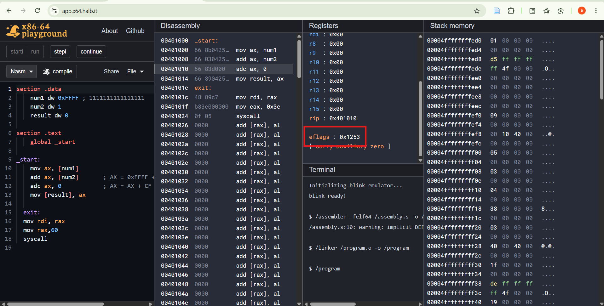
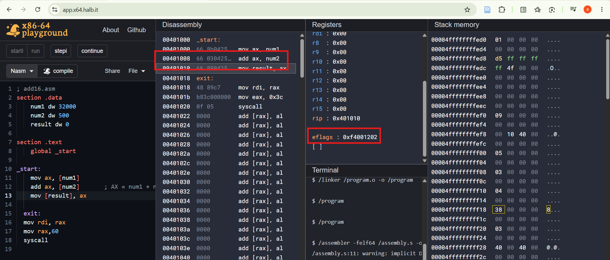

- CF = 1: 0xFFFF + 0x0001 = 0x10000, which needs 17 bits, so a carry came out of bit 15. This matches.
- ZF = 1: the 16-bit result 0x0000 is zero. This matches.
- SF = 0: bit 15 of 0x0000 is 0. This matches.
- OF = 0: as signed values this is -1 + 1 = 0. Operands of opposite sign can never overflow when added. This matches.
- AF = 1: the low nibbles are 0xF + 0x1 = 0x10, which carries out of bit 3. This matches.
- PF = 0 observed, but 1 expected: PF looks only at the low byte of the result. 0x00 has zero 1 bits (even parity), so ADD should set PF = 1. The expected EFLAGS is therefore 0x1257, not 0x1253.

- CF = 0: 0x7D00 + 0x01F4 = 0x7EF4 fits in 16 bits, so nothing carries out of bit 15.
- ZF = 0: the result 0x7EF4 is not zero.
- SF = 0: bit 15 of 0x7EF4 (0111 1110 1111 0100) is 0, so the result reads as positive.
- OF = 0: both operands are positive and the result is positive (32500 is below the signed maximum of 32767), so there is no signed overflow. This is close to the limit: adding 768 or more would have set OF.
- AF = 0: the low nibbles are 0x0 + 0x4 = 0x4, which doesn't carry out of bit 3.
- PF = 0: PF looks only at the low byte. 0xF4 = 11110100 has five 1 bits (odd parity), so PF = 0 is correct here.
