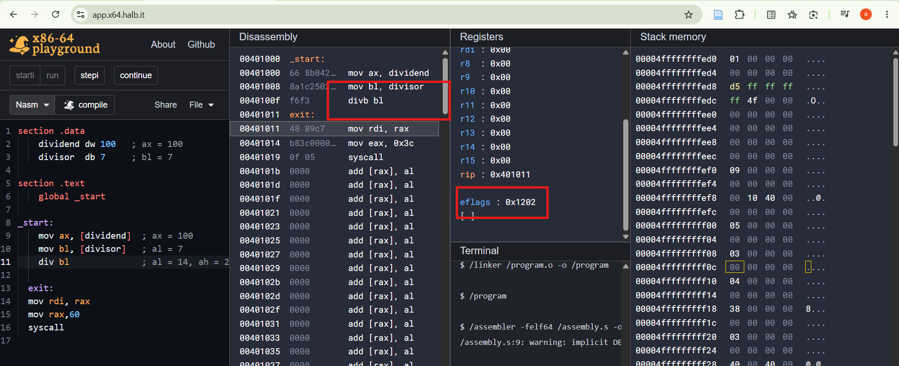
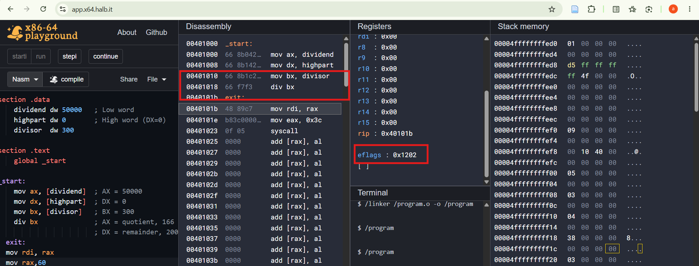

- CF = 0: no carry or borrow is reported. DIV signals overflow with a #DE exception, not CF, and none occurred since 14 fits in AL.
- ZF = 0: matches a non-zero quotient (14), but DIV doesn't update ZF.
- SF = 0: matches bit 7 of 0x0E being clear, but DIV doesn't update SF.
- OF = 0: matches no overflow, but DIV doesn't use OF to report one.
- PF = 0: matches 0x0E = 00001110 having three 1 bits (odd parity), but this is not a guaranteed result.
- AF = 0: matches no carry out of bit 3, but it is undefined after DIV.

CF = 0: no carry or borrow is reported. DIV signals overflow with a #DE exception, not CF, and none occurred since 166 fits in AX.
ZF = 0: matches a non-zero quotient (166), but DIV doesn't update ZF.
SF = 0: matches bit 15 of 0x00A6 being clear, but DIV doesn't update SF.
OF = 0: matches no overflow, but DIV doesn't use OF to report one.
PF = 0: PF looks at the low byte only. 0xA6 = 10100110 has four 1 bits, which is even parity, so PF would be 1 if it were computed from the quotient. The 0 here therefore doesn't even match the result, which shows these flags are not derived from it.
AF = 0: matches no carry out of bit 3, but it is undefined after DIV.

