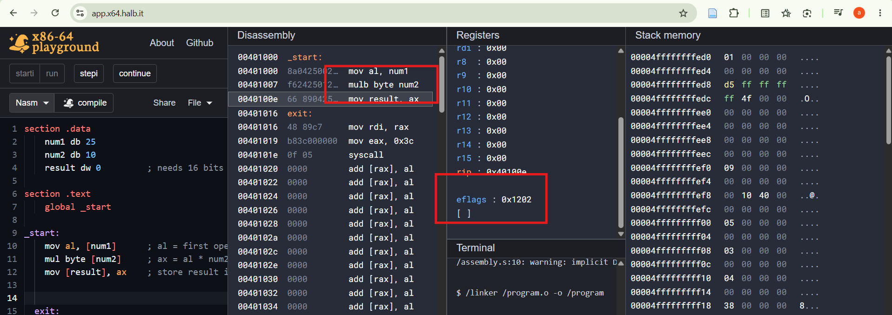
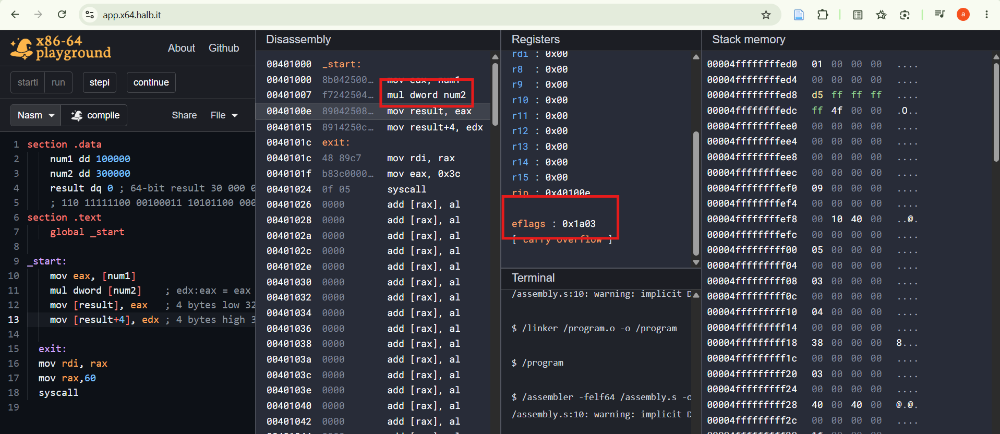

CF = 0 (defined): MUL sets CF to 1 only if the upper half of the result (AH) is non-zero. Here AH = 0 because 250 fits in 8 bits, so CF = 0.
OF = 0 (defined): MUL sets OF the same way as CF. AH = 0, so OF = 0. This is exactly what the flag is meant to report: the full result fits in the lower half.
ZF = 0 (undefined): matches a non-zero result (250), but MUL doesn't update ZF.
SF = 0 (undefined): matches bit 15 of AX being clear. Bit 7 of AL (0xFA) is actually 1, so which bit SF would copy is ambiguous. That is why it can't be relied on.
PF = 0 (undefined): 0xFA = 11111010 has six 1 bits, which is even parity, so PF would be 1 if computed from the result. The 0 here doesn't match, which shows PF isn't derived from the result.
AF = 0 (undefined): no meaningful carry out of bit 3 is reported by MUL.

CF = 1 (defined): MUL sets CF to 1 when the upper half of the result (EDX) is non-zero. Here EDX = 6, so the product doesn't fit in 32 bits and CF = 1.
OF = 1 (defined): MUL sets OF the same way as CF. EDX is non-zero, so OF = 1. This flags that EAX alone holds only part of the answer.
ZF = 0 (undefined): matches a non-zero product, but MUL doesn't update ZF.
SF = 0 (undefined): the top bit of EDX (0x00000006) is 0, which matches, but the top bit of EAX (0xFC23AC00) is 1, so it's ambiguous which half SF would reflect. That is why it can't be relied on.
PF = 0 (undefined): PF looks at the low byte only. The low byte of EAX is 0x00, which has zero 1 bits (even parity), so PF would be 1 if computed from the result. The 0 here doesn't match, which shows PF isn't derived from the result.
AF = 0 (undefined): MUL doesn't report a meaningful carry out of bit 3.
